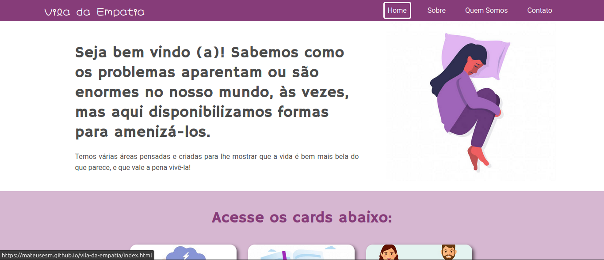
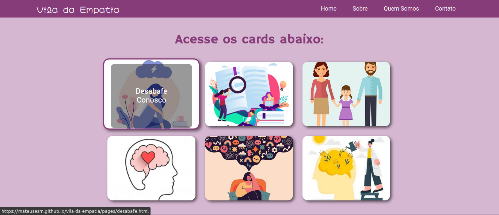
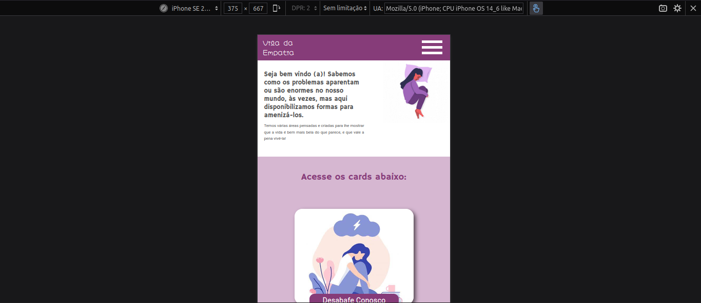
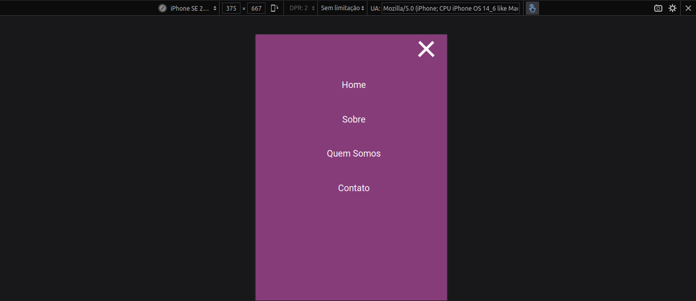

### Vila da Empatia

Trabalho do IFRN em que foi criado este projeto de site sem fins lucrativos, para ajudar pessoas, com Doenças Mentais e/ou que convivem ao lado de pessoas com Doenças Mentais.

#### Abaixo estão algumas imagens:

#### Página principal do sistema

#### Página principal do sistema no mobile

Baixe este repositório e abra o arquivo index.html no navegador de sua preferência para executar o projeto.
 
[Clique aqui para ver o site](https://mateusesm.github.io/vila-da-empatia/)
